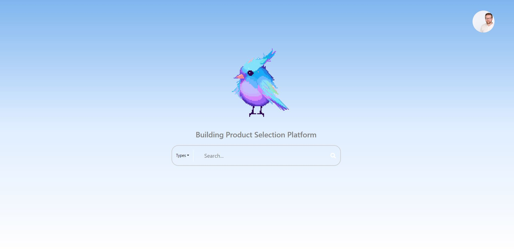
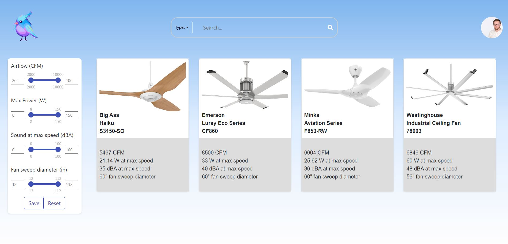

# Joole Ecommerce Concept

Joole is a  ecommerce project that showcases the integration of user JWT authentication, dynamic product loading from a database, search &filtering techniques, and a simple yet effective user interface to demonstrate the connection between the frontend and the robust backend.

## Screenshots

### Desktop

### Mobile

## Technology Used

The project utilizes the following technologies:

- React
- Redux
- Axios
- Java
- Spring Boot
- Spring Security
- MySql

Feel free to explore the project, and don't hesitate to reach out if you have any questions or feedback.
